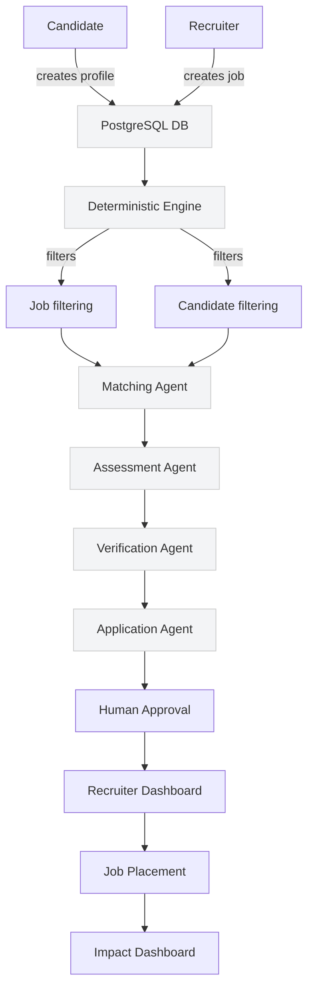

HERMATCH Architecture
=====================

The following diagram describes the high-level components and flow for the FRAUMATCH (HERMATCH) proof-of-concept. This is a demo architecture intended for university research and presentations; all data generated and used is synthetic.

Mermaid diagram (flow):

Mapping to repository
- `web/` — Next.js frontend (candidate and recruiter UIs, dashboards, match details)
- `api/` — FastAPI backend
  - `api/app/matching/engine.py` — deterministic engine implementation
  - `api/scripts/seed_demo_data.py` — deterministic demo data generator (100 candidates, 50 jobs)
  - `api/app/api/routers/api_v1.py` — matching API endpoints
  - `api/app/db/models.py` and `db/schema.sql` — data model and schema

Data flow summary
- Candidates and jobs are stored in PostgreSQL.
- The deterministic engine computes explainable component scores and an overall score; it also flags mandatory-requirement failures.
- Matching runs are logged to `matching_logs` for auditing and performance comparison.
- The Matching Agent is orchestrated by the backend: it performs filtering, scoring, and produces structured explanations used by the UI. Downstream agents (assessment, verification, application) are placeholders for later AI/microservice components and human workflows.

Ethics and constraints
- The deterministic engine avoids using protected attributes (gender, age, ethnicity, religion, disability, etc.) in scoring — scoring only uses job-relevant attributes. See comments in `api/app/matching/engine.py`.

Next steps
- Wire frontend pages (`web/app/candidate/jobs` and job detail) to call the matching endpoints and show recommended opportunities and match details.
- Add small background workers or endpoints to simulate Assessment/Verification agents for demos.
